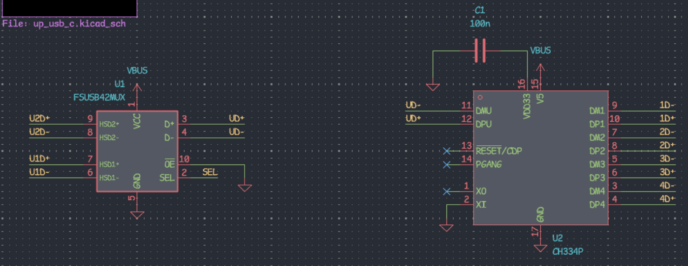
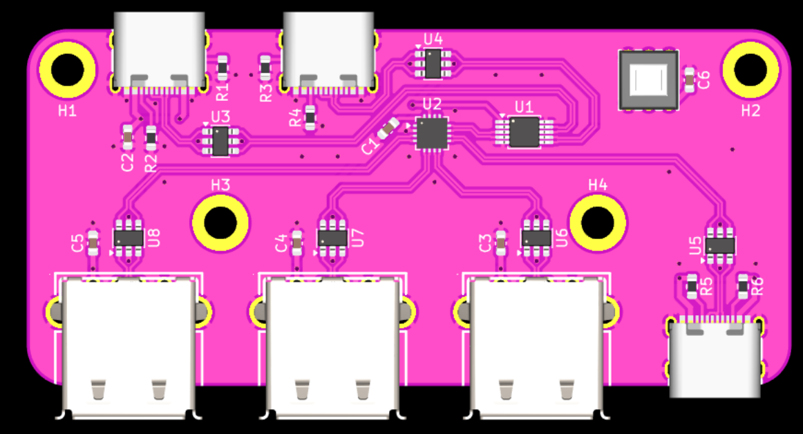
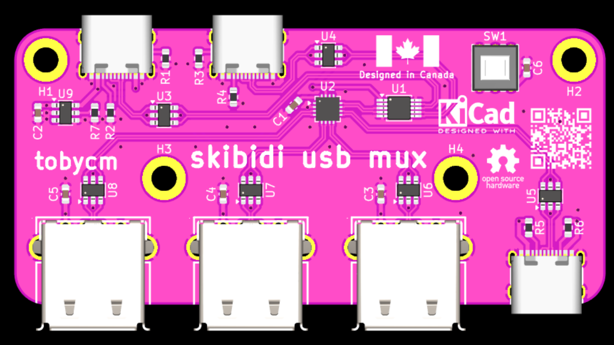
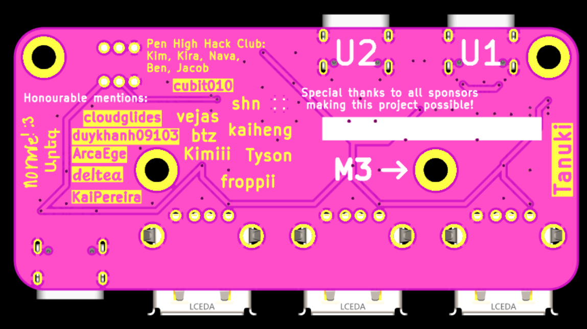

# August 19: Compiled a mental part list and started on schematic

Ended up with using the onsemi FSUSB42MUX for switching between 2 data pairs and using my favourite USB hub IC, the WCH CH334P, to expand to more ports.

**Total time spent: 1h**

# August 20: Completed the schematic and PCB layout and routing

The truth table for the state of the mux:

i realizd a latching switch is the best for this, so i picked the [G-Switch PS-5850A-6PL](https://www.lcsc.com/product-detail/C963201.html)

Final PCB look:

**Total time spent: 1h**

# August 20 night: Decorated PCB

Shoutout to everyone who agreed to be on my PCB 🔥🔥🔥

**Total time spent: 2h**